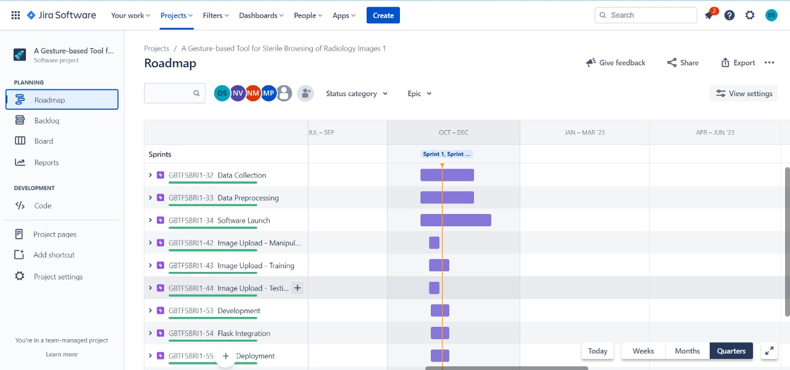
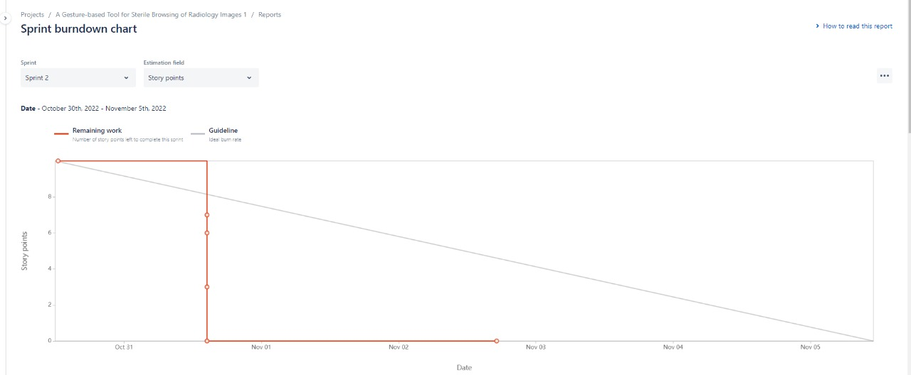
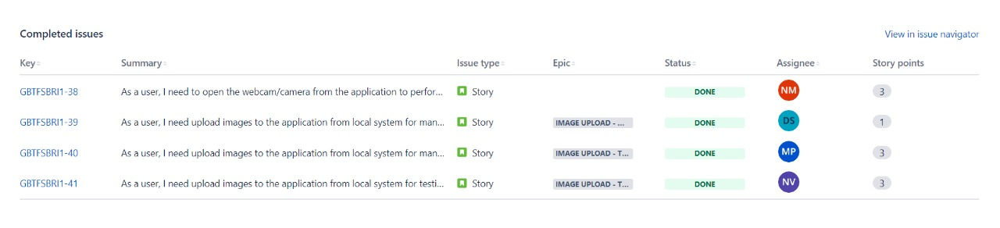
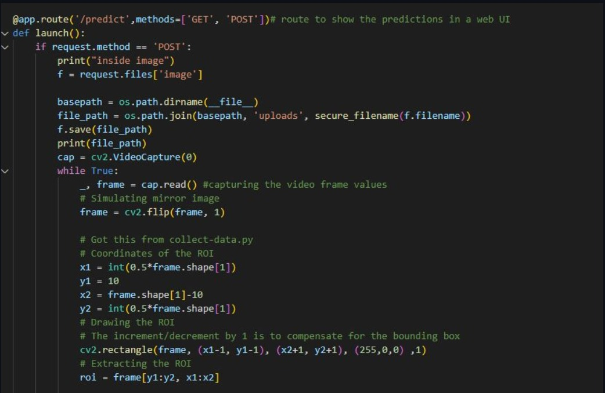
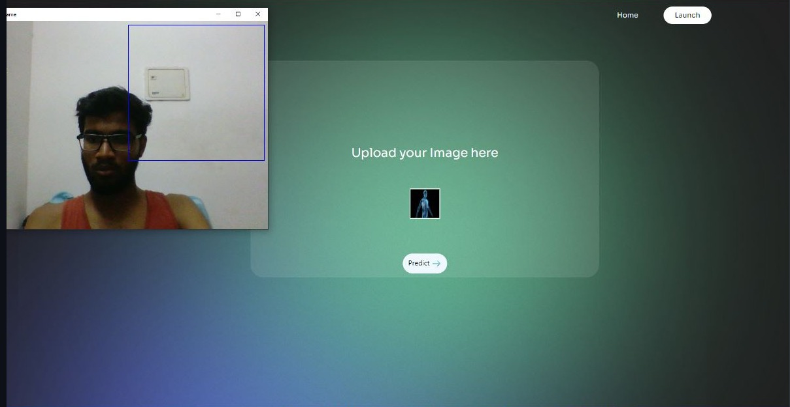
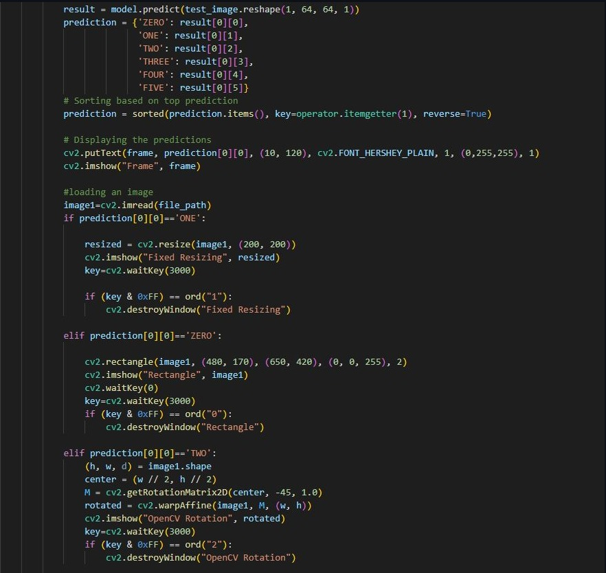
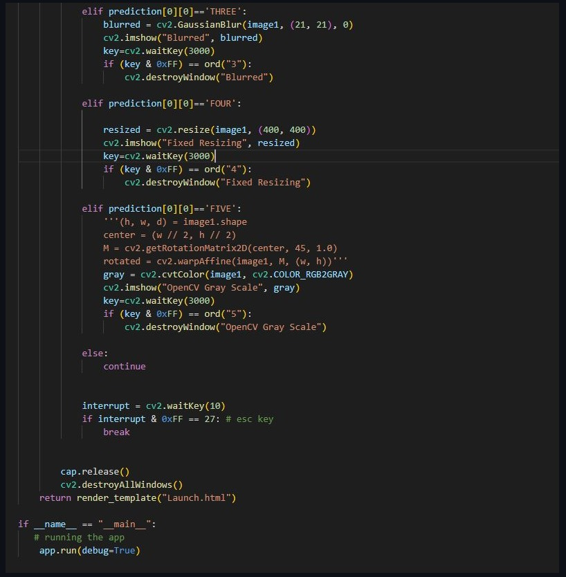
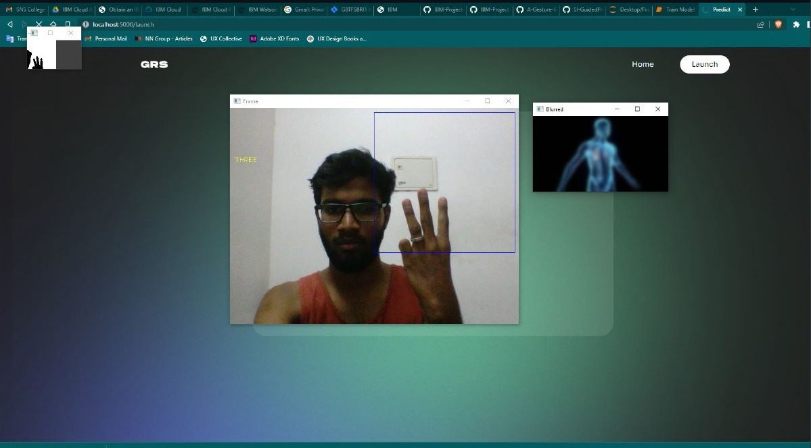
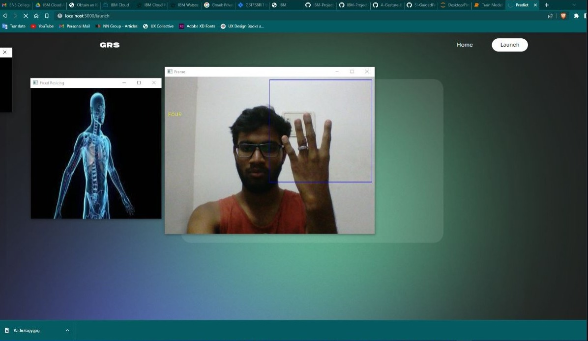
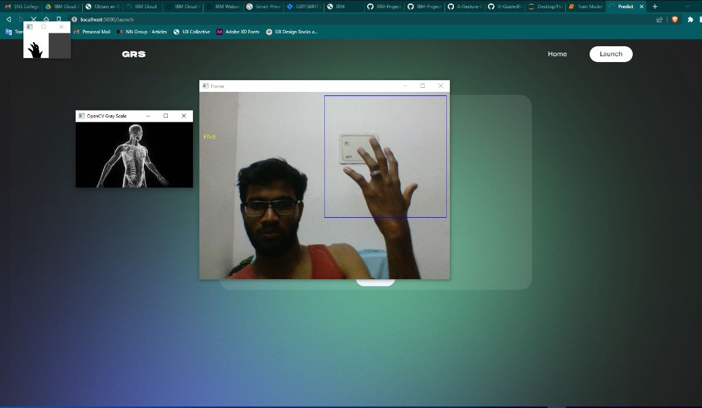

# Project Title - A Gesture-based Tool for Sterile Browsing of Radiology Images

## Sprint 2

## Description
The below listed are the tasks of Sprint 2

    -Launching Webcam/camera
    -Upload images from local system for manipulation
    -Upload images from local system for training
    -Upload images from local system for testing
    

## Our Workspace

## BurnDown Chart

## Sprint-2 Report

## Launching Webcam/camera

Below is the code snippet to launch camera

Below is the image of launching camera

## Upload images from local system for manipulation

Below is the code snippet to upload images for manipulation

## Upload images from local system for training

Below is the code snippet to upload images for training

 
 
## Upload images from local system for testing

Below is the output images after testing

|||
|:---:|:----:|
|||
|||

