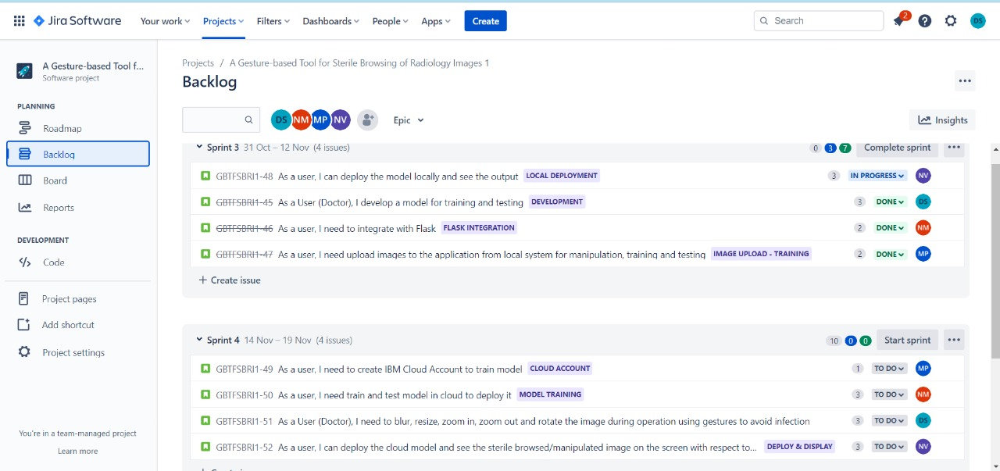
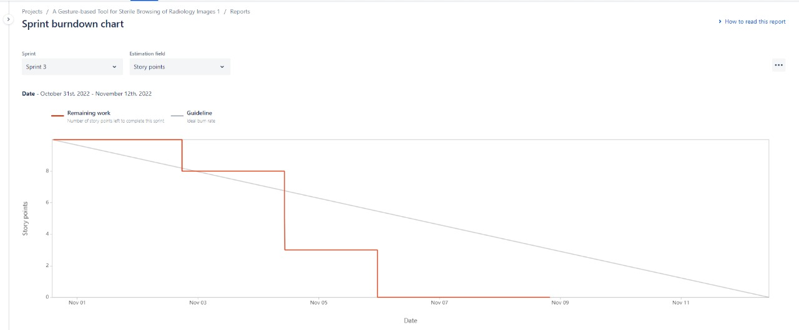
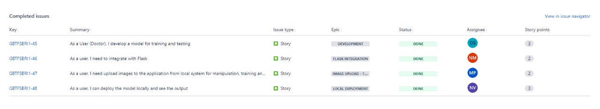
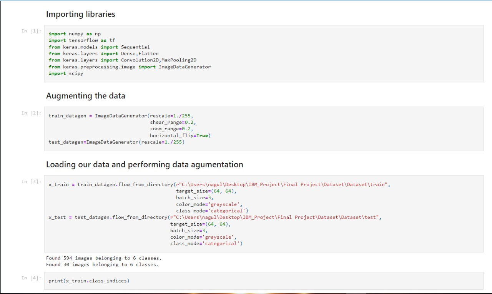
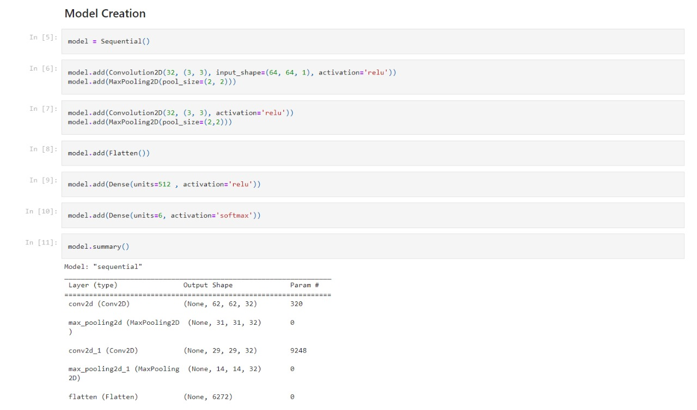
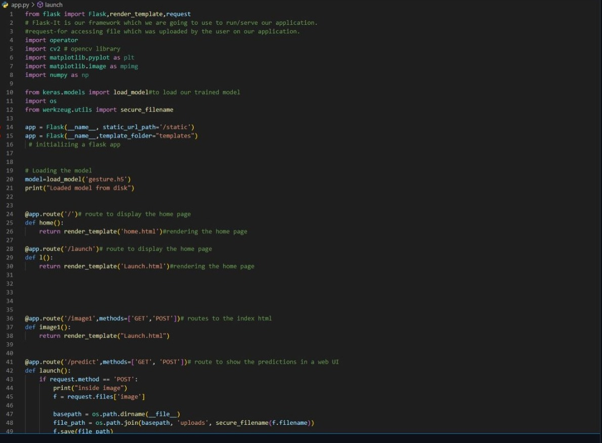
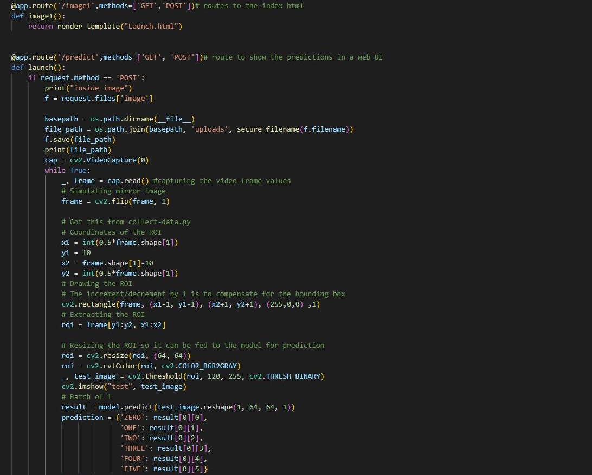
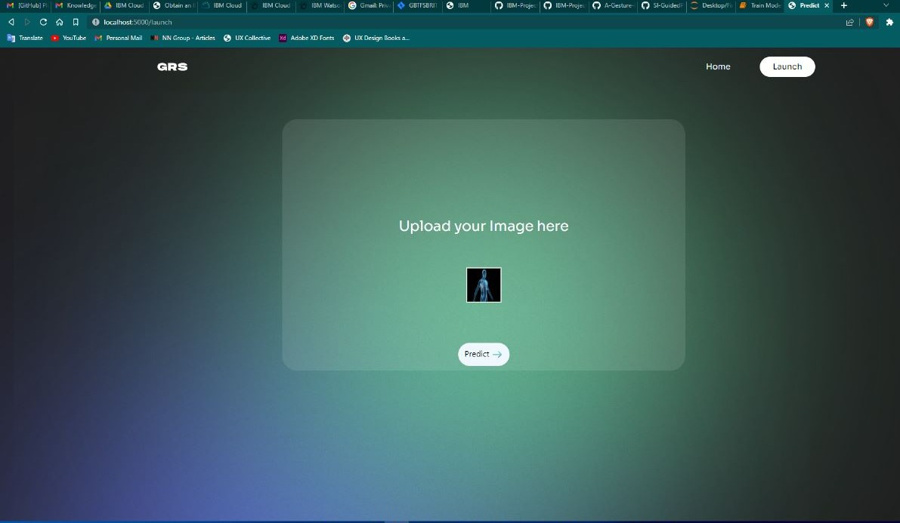

# Project Title - A Gesture-based Tool for Sterile Browsing of Radiology Images

## Sprint 3

## Description
The below listed are the tasks of Sprint 3

    -Model Development
    -Flask Integration
    -Upload images for local testing
    -Local Deployment
    

## Our Workspace

## BurnDown Chart

## Sprint-3 Report

## Model Development

Below is the code snippet to develop model

## Flask Integration

Below is the code snippet to integrate flask

## Upload images for local testing

Below is image uploading screen

 
 
## Local Deployment

Below is the code snippet for Home Page 

Below is the output for Home Page 

Below is the code snippet for Launch Page 

Below is the output for Launch Page 

