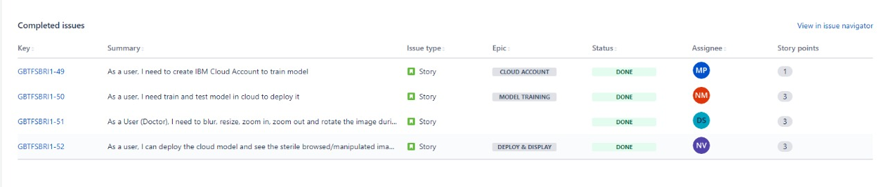
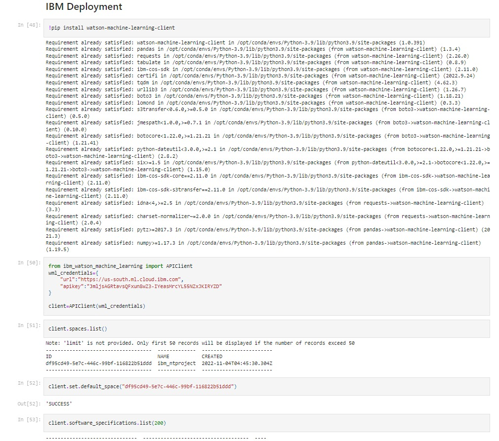

# Project Title - A Gesture-based Tool for Sterile Browsing of Radiology Images

## Sprint 4

## Description
The below listed are the tasks of Sprint 4

    -Cloud Account
    -Model Training
    -Manipulating images through gestures
    -Deploy & Display
    

## Our Workspace

## BurnDown Chart

## Sprint-4 Report

## Cloud Account

Below is the screenshot of our cloud account

## Model Training

Below is the code snippet of model training in IBM Cloud

## Manipulating images through gestures

Below is the code snippet for manipulating images

.jpeg)

.jpeg)

## Output of the model 

Below is the output after manipulating images through gestures

.jpeg)

.jpeg)

.jpeg)
 
 
## Deploy and Display

Below is the screenshot of cloud deployment 

Below is the output of our complete project  

.jpeg) 

